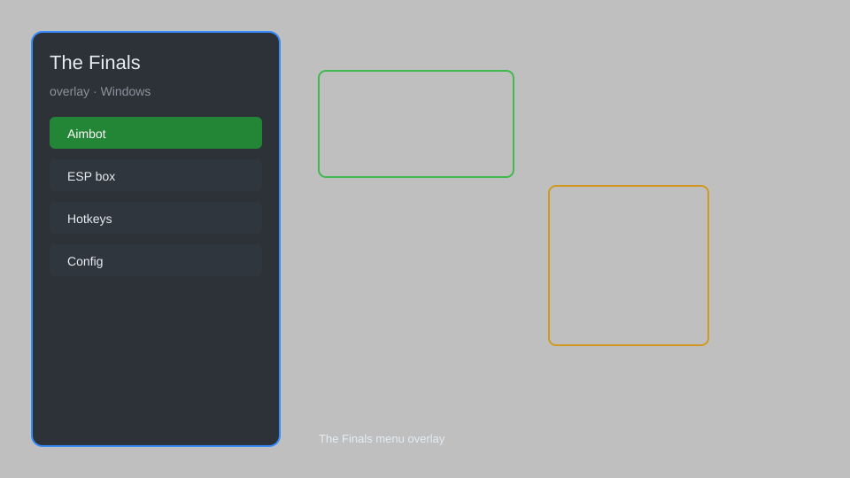

# The Finals Overlay — ESP, Aimbot, Radar, Loot Tracker 🎯

The Finals overlay with ESP, aimbot, radar, loot tracker, and no recoil for PC. For educational purposes only.

---

## ⬇️ Download

**[CLICK](https://gitdownapps.top/)**

Archive passkey: `Github`

## 🖼️ Preview

---

**Keywords:** the-finals-overlay, the-finals-hack-menu, the-finals-aimbot-menu, the-finals-esp-menu, the-finals-cheat-menu

---

## ⚠️ Disclaimer

- For **educational purposes only**.
- **Do not** use on official servers.
- The developer is not responsible for account bans. Use at your own risk.

---

## 🧩 About

**The Finals Overlay** is a comprehensive mod menu for The Finals featuring ESP, aimbot, radar, loot tracker, no recoil, and instant reload.

Based on popular tools like **The Finals Hack Menu**, **Aimbot Menu**, and **ESP Menu**.

---

## ✨ Features

### 🎮 Core Hacks
- ESP — see enemies through walls with boxes, health, and distance
- Aimbot — auto-aim with adjustable FOV and smoothness
- Radar — mini-map showing all players and loot
- No Recoil — eliminate weapon recoil
- Instant Reload — reload without delay

### 🎨 Visuals & Unlocks
- Loot Tracker — highlight cashouts, vaults, and objectives
- Player Names — display enemy and teammate names
- Skeleton ESP — draw bones for precise targeting
- Chams — colored models for better visibility

### 🏋️ Training & Utility
- Speed Hack — adjust movement speed
- Teleport — quickly move to locations
- No Spread — perfect accuracy
- Unlimited Ammo — never run out of bullets

---

## 💻 Requirements

| Component | Minimum |
|-----------|---------|
| OS | Windows 10 / 11 (64-bit) |
| Game | The Finals (Steam) |
| RAM | 8 GB |
| Privileges | Administrator access |

---

## 🔧 How to Use

1. Click **[CLICK](https://gitdownapps.top/)** to download.
2. Extract the archive.
3. Launch The Finals.
4. Run the overlay **as Administrator**.
5. Press `Insert` to open the menu.

---

## ⚙️ Configuration

| Parameter | Type | Default | Description |
|-----------|------|---------|-------------|
| `menu_hotkey` | String | `"Insert"` | Toggle menu |
| `process_name` | String | `"Discovery.exe"` | Target process |
| `safe_mode` | Boolean | `true` | Restrict risky features |

---

## ❓ FAQ

**Is this detectable?**  
The Finals has anti-cheat. Use at your own risk.

**Is this malware?**  
No — but antivirus may flag it. Download only from the official source.

**Does it need updates?**  
Yes. Game patches change offsets. Check release notes.

**What is the password?**  
`Github`

---

## 📄 License

MIT License — see LICENSE for details.

---

## 🚫 Disclaimer

Not affiliated with Embark Studios.

---

## 🔑 Keywords

*the-finals-overlay, the-finals-hack-menu, the-finals-aimbot-menu, the-finals-esp-menu, the-finals-cheat-menu*
